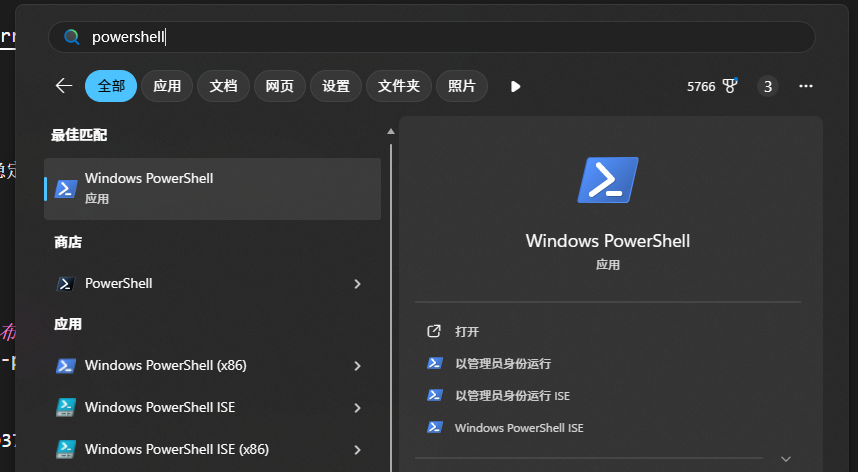
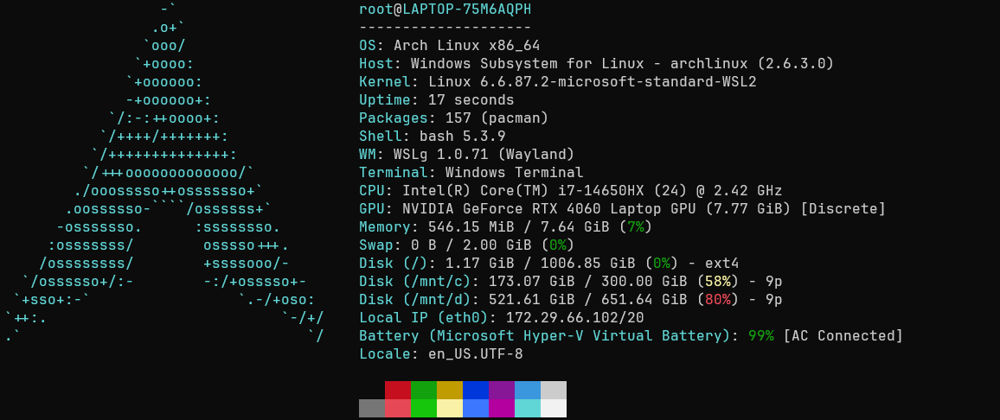

wsl作为一种在Windows系统下运行linux内核的方法，使用了hyper—V虚拟机技术，为双系统用户带来了很多的便利。

很多人早就听闻了wsl的大名但是却难以入手，我使用了一种较为简单且容易被新手接受的方法来使用wsl，从此开始起步会很容易掌握wsl的基本安装和使用。

我最近配置的是最基础的wsl的archlinux。

安装方法取自于archwiki，但是解决了初级用户在网络上的困难。相比使用魔法就常常为新手带来困扰的GitHub来说，这样的方法更加简单且稳定。

我原本选择的是debian且debian更加简单直接在Microsoft Store中下载即可。

如果没有较新的软件包需求且希望使用更加稳定的linux可以在下载完wsl后选择debian。

```
https://apps.microsoft.com/detail/9msvkqc78pk6?hl=zh-CN&gl=CN
```

## 配置

我使用的配置是联想拯救者y7000P IRX9

- 系统：win11家庭中文版    25H2 (OS 内部版本 26220.7752)
- cpu：Intel(R) Core(TM) i7-14650HX (2.20 GHz)
- gpu：NVIDIA GeForce RTX 4060(8GB)
- RAM：16.0 GB
- 存储：1TB

## wsl的下载

对于国内的网络环境，我认为Microsoft Store更加稳定简单

Windows Subsystem for Linux
```
https://apps.microsoft.com/detail/9p9tqf7mrm4r?hl=zh-CN&gl=CN
```

下载即可。

## archlinux的下载

我本人选择的是官方wsl镜像
```
https://geo.mirror.pkgbuild.com/wsl/latest/archlinux.wsl
```

## 更新wsl

需要更新到最新稳定版的wsl和wslg，且需要使用wsl2。

首先在管理员权限的powershell中（管理员启动）



```PowerShell
# 更新wsl
wsl -update

#若要更新到预发布版本
wsl --update --pre-release
```

### 常见错误

若显示错误 0x80370114 是 WSL 2 虚拟化没启用，内核组件缺失。

管理员启动powershell

```powershell
# 启用虚拟化平台
dism.exe /online /enable-feature /featurename:VirtualMachinePlatform /all /norestart

# 设置 WSL 默认版本为 2
wsl --set-default-version 2

# 重启电脑


#若还不行，则需要补装wsl内核更新包
# 下载微软官方内核更新（WSL2 需要）
curl -L -o wsl_update.msi https://wslstorestorage.blob.core.windows.net/wslblob/wsl_update_x64.msi
#装完双击运行msi，重复上述正常步骤（不过本人没有遇到这样的问题，一般不会有此步骤）
```

### 验证状态

```powershell
wsl --status
wsl --list --verbose
```

应当显示wsl 2.x.x且没有错误

## 安装arch.wsl

双击即可，自动安装，随后进入archlinux，由于wsl版本的arch没有内核，预装软件少，配置文件少，所以比较小，只有150mb左右。

## root

1. 下载完成之后首先update

linux的命令行默认为bash。

```bash
#更新整个系统
pacman -Syu
```

- s：同步
- y：刷新
- u：更新

所以连起来就是：
*刷新软件包数据库，然后同步系统（升级所有可升级的软件包）*

1. 创建普通用户

```bash
#创建用户
useradd -m -G wheel aye

#设置密码
passwd aye

#设置root密码（安全起见）
passwd
```

## pacman

### 下载vim或者nano

该版本的arch较为精简，所以没有预装vi，vim和nano

```bash
#切换镜像源
#tinghua
echo "Server = https://mirrors.tuna.tsinghua.edu.cn/archlinux/\$repo/os/\$arch" > /etc/pacman.d/mirrorlist
#ustc
echo "Server = https://mirrors.ustc.edu.cn/archlinux/\$repo/os/\$arch" >> /etc/pacman.d/mirrorlist

#下载vim和nano
pacman -S vim nano

#vim打开pacman配置
vim /etc/pacman.conf
```

随后可以解注释Color，更加方便，也可以添加ILoveCandy改为吃豆人进度条

其中vim是文本编辑器，使用起来较notepad（记事本）复杂，也可以选择nano，相比vim有提示，更加简单

> vim的基本入门我可以再写一篇简单易懂的文章，有意催更。

[tips]关于镜像源的写法

```bash
# 方法1：单引号（不需要转义，因为单引号里 $ 本来就不是变量）
echo 'Server = https://mirrors.tuna.tsinghua.edu.cn/archlinux/$repo/os/$arch' > /etc/pacman.d/mirrorlist

# 方法2：双引号但不转义（如果当前 shell 里没有定义 $repo 和 $arch 变量）
echo "Server = https://mirrors.tuna.tsinghua.edu.cn/archlinux/$repo/os/$arch" > /etc/pacman.d/mirrorlist
```

## 开放sudo权限

现在我们都是在root上对系统进行操作，没有保护，比较危险，所以我们要向wheel组的所有用户开放sudo权限，这样对系统的保护较好。

```bash
#设置sudo
EDITOR=vim visudo
#或者
EDITOR=nano visudo
```

随后打开配置文件。

使用"/"来找到`%wheel ALL=(ALL:ALL) ALL`这句话，删除前面的井号“#”，去除了注释后即可生效。

第一个`ALL`：允许在任何主机上执行,`(ALL:ALL)`：可以以任何用户和任何组的身份执行，最后一个`ALL`：可以执行任何命令

单个加入

```bash
# 将用户添加到 wheel 组
sudo usermod -aG wheel username

# 然后该用户就可以使用 sudo 了
sudo systemctl restart service_name
```

## 下载软件

```bash
sudo pacman -S neovim git tmux fastfetch curl wget
```

### fastfetch

用于展示系统信息,替代neofetch

```bash
fastfetch
```

随后显示这一串信息



### nvim和lazyvim

我个人使用nvim，并且在这台机器上使用了lazyvim。

lazyvim在win上的操作逻辑并不好所以我在arch上使用。

一个vim分支的编辑器，高度可定制且使用vim的操作逻辑，相对比较舒适。

当然，如果你无法忍受这样的操作逻辑，可以拉起win里的编辑器或编译器。

如：使用终端拉起vscode

```bash
code
```

就可以直接拉起vscode图形化界面。

### tmux

一个终端复用工具，可以在一个终端窗口内同时管理多个终端对话，且可以实现会话的后台运行、断开重连等功能。

尤其在ssh连接服务器后，若使用tmux创建会话，即使关闭终端窗口或网络断开，会话仍在后台运行，重连后可恢复。

此外，多个用户还可以连接同一个tmux会话，实现终端操作共享

### git

版本管理工具，不再赘述。

## 启动与关机

```bash
#挂载启动
wsl -d archlinux

#60s后关机
shutdown

#或者
poweroff

#或者立即关机
shutdown now

#重启
reboot
```

至此，一个完全可控可用的arch已经在wsl上部署好了，非常简单，对新手来说相对友好。

当然我也希望各位大佬可以给我一些更好的建议，我也在不断学习。