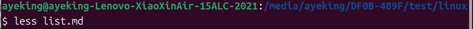
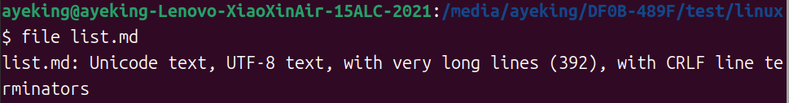

# List

## ls(list files and directories) - 列出文件和目录

Used to list the contents of a directory.

There some ways to use:

- `ls` - List the files in working directory
- `ls /bin` - List the files in the `/bin` directory (or any directory)
- `ls -l` - List the files in the working directory in long format
- `ls -l /etc /bin` - List the files in the `/bin` and `/etc` directory in long format.
- `ls -la` - List all files() 

## Commands operate

Most commands operate like 

```bash
command -options arguments
```

where command is the name of the command, -options is one or more adjustments to the command's behavior, and arguments is one or more "things" upon which the command operates.

## Long Format

If use the `-l` option with `ls`, you will get a file listing that contains a wealth of information about the files being listed

```bash
-rw-------   1 me       me            576 Apr 17  2019 weather.txt
drwxr-xr-x   6 me       me           1024 Oct  9  2019 web_page
-rw-rw-r--   1 me       me         276480 Feb 11 20:41 web_site.tar
-rw-------   1 me       me           5743 Dec 16  2018 xmas_file.txt

----------     -------  -------  -------- ------------ -------------
    |             |        |         |         |             |
    |             |        |         |         |         File Name
    |             |        |         |         |
    |             |        |         |         +---  Modification Time
    |             |        |         |
    |             |        |         +-------------   Size (in bytes)
    |             |        |
    |             |        +-----------------------        Group
    |             |
    |             +--------------------------------        Owner
    |
    +----------------------------------------------   File Permissions
```

Then you can see some informations about:

- **File Name**
The name of the file or directory
- **Modification Time**
The last time the file was modified. If the last modification occurred more than six months in the past, the date and year are displayed. Otherwise, the time of day is shown.
- **Size**
The size of the file in **bytes**.
- **Group**
The name of the group that has file permissions in addition to the file's owner.
- **Owner**
- **File Permissions**
A repersentation of the file's access permissions. The first character is the type of file. A "-" indicates a regular (ordinary) file. A "d" indicates a directory. The second set of three characters represent the read, write, and execution rights of the file's owner. The next three represent the rights of the file's group, and the final three represent the rights granted to everybody else.

## less(view text files) - 查看文本文件

`less` is a program that lets us view text files.

The `less` program is invoked by simply typing:



### How to controlling less

Once started, less will display the text file one page at a time.

Use the Page Up(PgUp) and Page Down(PgDn) keys to move through the text file.

Here are some commands that *less* will accept:

- **Page Up/ b**
Scroll back one page
- **Page Down/ space**
Scroll forward one page
- **G**
Go to the end
- **1G**
Go to the beginning
- **/characters**
Search forward in the text file for an occurrence of the specified characters
- **n**
Repeat the previous search
- **h**
Display a complete list less commands and options
- **q**
quit

Both of them are similar to Vim.

## Text

There are many ways to represent information on a computer and all methods involve defining a relationship between the information and some numbers that will be used to repersent it. Computers only understand numbers and all data is converted to numberic repersentation.

One of the earliest and simplest is called *ASCII* text - short for American Standard Code for Information Interchange.

Text is a simple one-to-one mapping of characters to numbers. It's very compact. Fifty characters of text translates to fifty bytes of data.

## file(classify a file's contents) - 对文件内容进行分类

`file` will examine a file and tell us what kind of file it is.

```bash
file name_of_file
```



The **file** program can recognize most of files, Such as:

|File Type|Description|Viewable as text?|
|---------|-----------|-----------------|
|ASCII text|As name|Y|
|Bourne-Again shell script text|A bash script|Y|
|ELF 64-bit LSB executable|An executable binary program|N|
|ELF 64-bit LSB shared object|An shared library|N|
|GNU tar archive|A tape archive file. A common way of storing groups of files|N, use tar tvf to view listing|
|gzip compressed data|An archive compressed with **gzip**|N|
|HTML document text|A web page|Y|
|PostScript document text|A PostScript file|Y|
|Zip archive data|An archive compressed with **zip**|N|

An amount of number of files can be viewd as text.This is especially true of the important configuration files.Many features of the operating system are controlled by text configuration files and shell scripts.